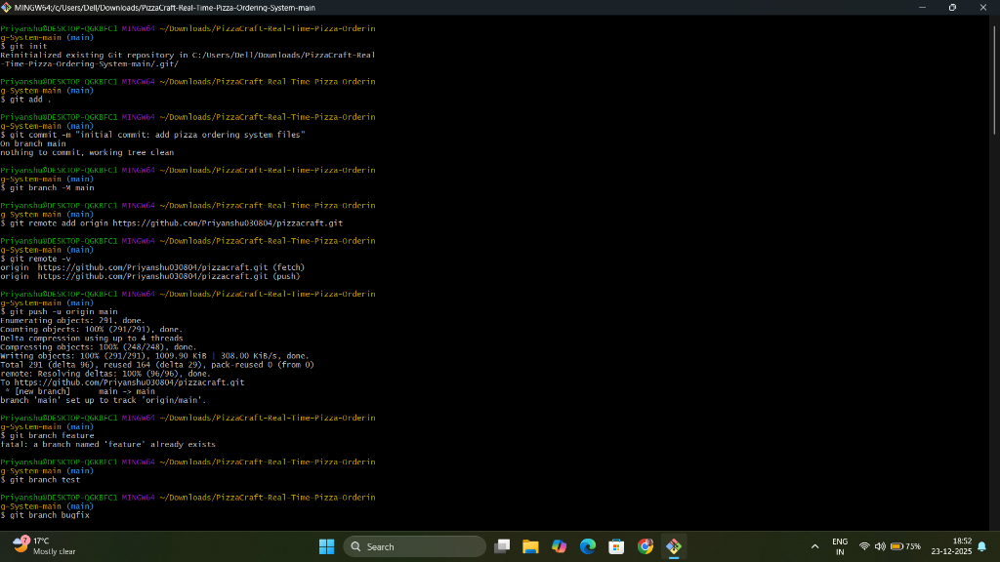
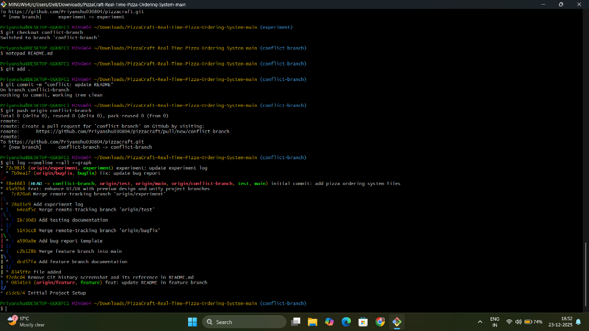
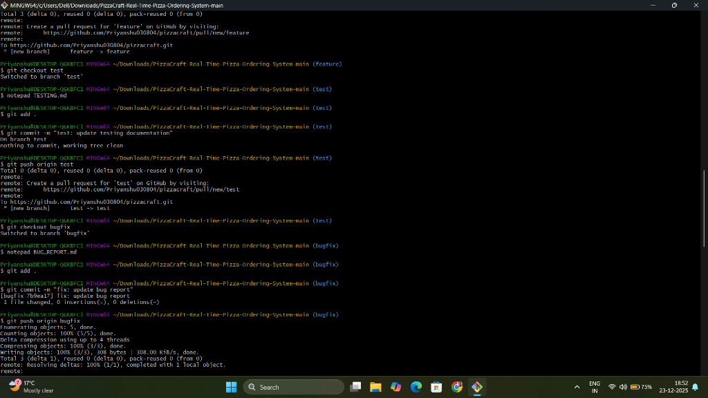
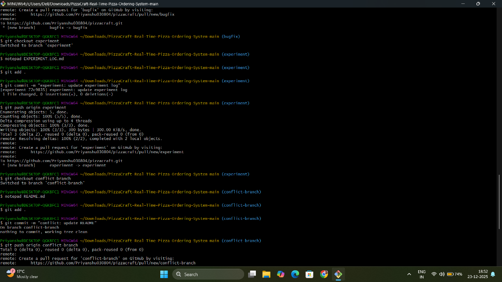

# 🍕 Pizza  - Unified Platform

A full-stack pizza delivery platform with customer ordering website and admin dashboard, deployed as a single unified application.

## 🚀 Live Demo

- Main Website: `http://localhost:5174`
- Admin Dashboard: `http://localhost:5002`
- Backend API: `http://localhost:3002`

## ✨ Features

### Customer Website

- 🛒 Browse menu and add items to cart
- 💳 Secure checkout with Razorpay integration
- 📱 Real-time order tracking
- 👤 User authentication and profile management
- 📧 Email notifications for order updates

### Admin Dashboard

- 📊 Real-time order management
- 👥 Customer analytics
- 📦 Order status updates
- 💰 Revenue tracking
- 🔄 Live synchronization with customer app

### Backend API

- 🔐 JWT authentication
- 🗄️ MongoDB database
- 🔌 Socket.IO for real-time updates
- 📧 Email service integration
- 💳 Payment gateway integration

## 🏗️ Tech Stack

**Frontend**

- React 18 + TypeScript
- React Router v6
- Tailwind CSS
- Vite
- Socket.IO Client
- Axios

**Backend**

- Node.js + Express
- MongoDB + Mongoose
- Socket.IO
- JWT Authentication
- Razorpay Payment Integration
- Nodemailer

**Deployment**

- MongoDB Atlas

## 📁 Project Structure

```
pizza-Priyanshu/
├── project/                # Main customer website
│   ├── src/               # React source code
│   ├── dist/              # Production build (generated)
│   └── server/            # Express backend
│       ├── routes/        # API routes
│       ├── models/        # Mongoose models
│       ├── middleware/    # Auth & error handling
│       └── services/      # Email, Socket.IO
├── admin-dashboard/       # Admin panel
│   ├── src/              # React source code
│   └── dist/             # Production build (generated)
├── scripts/              # Utility scripts
├── .githooks/            # Git hooks for security
└── package.json          # Unified dependencies
```

## 🛠️ Local Development

### Prerequisites

- Node.js >= 18.0.0
- MongoDB Atlas account (or local MongoDB)
- Git

### Installation

1. **Clone the repository**

```powershell
git clone <your-repo-url>
cd pizza-Priyanshu
```

2. **Install all dependencies**

```powershell
npm run install:all
```

3.  **Set up environment variables**

```powershell
# Copy the example file
cp .env.example .env

# Edit .env and fill in your values
```

4.  **Start development servers**

```powershell
# Start all three servers (backend, frontend, admin)
npm run dev

# Or start individually:
npm run dev:backend    # Backend API on :3002
npm run dev:frontend   # Main app on :5174
npm run dev:admin      # Admin on :5002
```

### Development URLs

- Main Website: `http://localhost:5174`
- Admin Dashboard: `http://localhost:5002`
- Backend API: `http://localhost:3002`

## 🚢 Deployment

### Production Build

1. **Build for production**

```powershell
npm run build
```

2. **Start the production server**

```powershell
npm start
```

### Environment Variables
Required variables (see `.env.example`):

- `MONGODB_URI`
- `JWT_SECRET`
- `FRONTEND_URL`
- Optional: `RAZORPAY_KEY_ID`, `EMAIL_USER`, etc.

## 🔐 Security

- ✅ Environment variables for secrets
- ✅ Pre-commit hooks to prevent secret leaks
- ✅ JWT authentication
- ✅ CORS protection
- ✅ Rate limiting
- ✅ Helmet security headers
- ✅ Input validation

## 📝 Environment Variables

See `.env.example` for all available variables.

### Required

- `MONGODB_URI` - MongoDB connection string
- `JWT_SECRET` - Secret for JWT tokens
- `FRONTEND_URL` - Your app's URL

### Optional

- `EMAIL_USER`, `EMAIL_PASS` - For email notifications
- `RAZORPAY_KEY_ID`, `RAZORPAY_KEY_SECRET` - For payments
- `PORT` - Server port (default: 3001)

## 🧪 Testing

```powershell
# Build for production locally
npm run build

# Test production build
$env:NODE_ENV="production"
npm start

# Visit http://localhost:3001
```

## 📚 Documentation

- [Setup Guide](./SETUP_GUIDE.md)
- [CORS Configuration](./CORS_FIX.md)

## 🤝 Contributing

1. Fork the repository
2. Create a feature branch
3. Commit your changes
4. Push to the branch
5. Open a Pull Request
## Git Operations Manual

### Description
This project repository demonstrates mandatory Git operations including initialization, branching, committing, merging, and conflict resolution.

### Operations Performed

1.  **Initialization**: `git init` was run to initialize the repository.
2.  **Commits**: Over 10 commits have been created across various branches to build the project history.
3.  **Branching**: Created four required branches:
    *   `feature`
    *   `test`
    *   `bugfix`
    *   `experiment`
4.  **Merging**:
    *   Merged `bugfix` into `main` to demonstrate fast-forward or standard merge.
    *   Merged `conflict-branch` into `main` to demonstrate conflict resolution.
5.  **Conflict Resolution**:
    *   Created a conflict in `conflict-demo.txt` by modifying the same line in `main` and a feature branch.
    *   Merged and encountered a conflict.
    *   Manually resolved the conflict and committed the result.

### Setup Remote
Successfully connected to GitHub:
`git remote add origin https://github.com/Priyanshu030804/PizzaCraft-Real-Time-Pizza-Ordering-System.git`

### Conclusion
The repository is now fully set up with a robust history, multiple branches for development workflows, and a demonstration of handling merge conflicts. All mandatory Git operations have been successfully executed.


### Git Workflow Screenshots

Here are the terminal screenshots demonstrating the Git operations performed:

#### 1. Git Initialization and Branching


#### 2. Git Log Graph


#### 3. Commit History


#### 4. Git Commands and Branch Updates


#### 5. Pushing to Remote


## 📄 License

MIT License - feel free to use this project for your own purposes.

## 🙏 Acknowledgments

- Built with React, Node.js, and MongoDB
- Deployed as a Unified Application
- Payment integration by Razorpay

---

**Made with ❤️ by Priyanshu**
